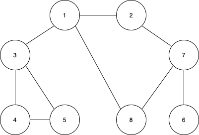

`DFS/BFS` 는 그래프 탐색 알고리즘이다. 따라서 그래프 자료구조에 대한 이해가 선행되어야 하는데, [그래프에 대해서는 다른 포스트에서 간단하게 정리해두었다.](https://velog.io/@syc1013/%EA%B7%B8%EB%9E%98%ED%94%84Graph%EC%99%80-%EB%91%90-%EA%B0%80%EC%A7%80-%ED%91%9C%ED%98%84%EB%B0%A9%EC%8B%9D)

`DFS`, `BFS`는 공통적으로 그래프의 모든 노드를 탐색(방문)하기 위한 알고리즘이다. 

`DFS`는 Depth-First Search, 깊이 우선 탐색이라고 부르며, 그래프에서 가장 깊은 곳 까지 우선적으로 탐색하는 알고리즘이다. 
`BFS`는 Breadth-First Search, 너비 우선 탐색이라고 부르며, 그래프에서 너비, 즉 한 노드에서 가장 가까운 노드들을 우선적으로 탐색하는 알고리즘 이다. 
***

위 그래프를 두 알고리즘으로 탐색해보려고 한다.
## 👉 DFS
`DFS` 알고리즘은 `stack(스택)`자료구조를 활용하여 깊이 우선 탐색을 한다. 구체적인 동작 과정은 다음과 같다. 
### 동작 과정
> 
1. 탐색 시작 노드를 스택에 삽입한다.
2. 아래 과정을 스택이 빌 때 까지 반복한다. 
	- 스택에서 노드를 꺼낸다.(pop)
    - 이미 방문한 노드이면 skip, 아니면 방문 처리하고 모든 인접노드를 스택에 삽입한다.(push)

`DFS`는 이론상 위 처럼 스택 자료구조를 활용한다. 하지만 실제로 코드로 구현할 때는 `재귀함수(recursion)`을 통해 구현할 수 있다. 재귀함수의 동작 원리가 스택과 같기 때문에 재귀함수를 활용해 심플하게 구현할 수 있다.

### 예제코드(python)
다음 예제코드는 『이것이 코딩테스트다! with 파이썬』 의 예제코드이다.
```python
# DFS 메서드 정의
def dfs(graph, v, visited):
    # 현재 노드를 방문 처리
    visited[v] = True
    print(v, end = ' ')
    # 현재 노드와 연결된 다른 노드를 재귀적으로 방문
    for i in graph[v]:
        if not visited[i]:
            dfs(graph, i ,visited) # 재귀적으로 호출

# 각 노드가 연결된 정보를 리스트 자료형으로 표현(2차원 리스트)
graph = [
    [],
    [2, 3, 8],
    [1, 7],
    [1, 4, 5],
    [3, 5],
    [3, 4],
    [7],
    [2, 6, 8],
    [1, 7]
]

# 각 노드가 방문된 정보를 리스트 자료형으로 표현(1차원 리스트)
visited = [False] * 9

#정의된 DFS 함수 호출
dfs(graph, 1, visited)

```
위처럼 그래프를 2차원 리스트로 인접행렬 형태로 표현하고, `visited`리스트를 통해 방문 처리를 한다. 그리고 재귀적으로 함수가 호출 되면서 다음과 같은 순서로 깊이 우선 탐색을 하게 된다. 
```bash
1 2 7 6 8 3 4 5
```
위에 첨부한 그래프 그림을 보면서 순서를 따라가 보면 깊이 우선 탐색임을 알 수 있다. 
***
## 👉 BFS
`BFS`알고리즘은 `queue(큐)` 자료구조를 활용해 구현한다. 시작 노드에서 가장 가까운 인접노드들을 우선적으로 탐색하므로, 선입선출 방식의 `queue`를 활용한다. 
### 동작과정
>
1. 시작노드를 `queue(큐)`에 삽입한다.
2. 큐가 빌때 까지 다음을 반복한다.
	* 큐에서 노드를 꺼낸다.(dequeue)
    * 이미 방문한 노드이면 skip, 아니면 방문처리하고 모든 인접노드들을 큐에 삽입한다.(enqueue)

`BFS`는 이론상 큐 자료구조를 사용하는데, 파이썬에서는 `collections` 모듈의 `deque` 자료구조를 사용하면 편리하다. `deque`는 삽입/삭제 속도가 리스트 자료형에 비해 효율적이라는 특징이 있고, `popleft`와 `append` 메서드를 통해 큐를 구현할 수 있다.  
### 예제코드(python)
다음 예제코드는 『이것이 코딩테스트다! with 파이썬』 의 예제코드이다.
```python
from collections import deque

# BFS 함수 정의
def bfs(graph, start, visited):
    # 큐(Queue) 구현을 위해 deque 라이브러리 사용
    queue = deque([start])
    # 현재 노드를 방문 처리
    visited[start] = True
    # 큐가 빌 때까지 반복
    while queue:
        # 큐에서 하나의 원소를 뽑아 출력
        v = queue.popleft()
        print(v, end=' ')
        # 해당 원소와 연결된, 아직 방문하지 않은 원소들을 큐에 삽입
        for i in graph[v]:
            if not visited[i]:
                queue.append(i)
                visited[i] = True

# 각 노드가 연결된 정보를 리스트 자료형으로 표현(2차원 리스트)
graph = [
  [],
  [2, 3, 8],
  [1, 7],
  [1, 4, 5],
  [3, 5],
  [3, 4],
  [7],
  [2, 6, 8],
  [1, 7]
]

# 각 노드가 방문된 정보를 리스트 자료형으로 표현(1차원 리스트)
visited = [False] * 9

# 정의된 BFS 함수 호출
bfs(graph, 1, visited)
```
위처럼 그래프를 2차원 리스트로 인접행렬 형태로 표현하고, `visited`리스트를 통해 방문 처리를 한다. 그리고 큐가 빌때까지 반복함에 따라 다음 순서로 그래프의 노드를 방문하게 된다.  
```bash
1 2 3 8 7 4 5 6
```
위에 첨부한 그래프 그림을 보면서 순서를 따라가 보면 가장 가까운 노드부터 탐색하는 너비 우선 탐색임을 알 수 있다. 
***
## 📚 Reference
> 
* 『이것이 취업을 위한 코딩테스트다! with 파이썬 』, 나동빈 지음
https://github.com/ndb796/python-for-coding-test