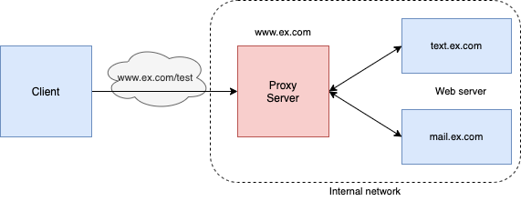

## 프록시 서버(Proxy Server)
오늘은 프록시 서버의 개념에 대해 정리해보려고 한다. 

`프록시 서버`는 인터넷 상의 여러 네트워크들에 접속할 때 중계 역할을 해주는 프로그램 또는 컴퓨터를 말한다. 요청을 중계하는 컴퓨터/프로그램을 뜻한다고 이해할 수 있다. 

프록시 서버를 구축하는 **이유**는
>
🔍 [참고 - joinc.co.kr](https://www.joinc.co.kr/w/Site/System_management/Proxy)
1. **보안**: 익명의 사용자가 서버에 직접 접근하는것 방지
2. **속도**: 사용자의 요청을 cache해서 동일한 요청에 대해 cache의 자원을 반환 => 서비스 속도 향상
3. **ACL**: 사이트 접근에 대한 접근 정책 정의 가능
4. **Log/Audit**: 회사 내 인터넷 사용/ 인트라넷 사용 reporting이 가능
5. **지역 네트워크의 제한 우회**: 예로, 80번 포트 이외에 막혀있는 경우 제한을 우회하여 사용할 수 있다.

프록시는 사용자의 로컬 컴퓨터 혹은 인터넷 상에서 사용자 컴퓨터와 타겟 서버 사이 어느 곳에든 존재할 수 있다.
## 종류
프록시 서버의 종류에는 3가지가 있다. 
`Forward Proxy`, `Reverse Proxy`, `Open Proxy` 이다.

### Forward Proxy

`Forward Proxy`는 일반적으로 사용하는 프록시 방식으로 클라이언트와 애플리케이션 서버 사이에서 요청을 중계한다. 이 때, 인터넷으로 연결된 어느 곳이든 요청을 주고 받는다. 일반적으로 타겟 서버로 요청을 단순히 중계해주는 역할이다. 
### Reverse Proxy

`Reverse Proxy`는 `Forward proxy`와 반대되는 일을 하기 때문에 이러한 이름이 붙었다. `Forward Proxy`의 경우, 요청을 중계하면서 client가 target server 로 부터 숨겨지게 된다. 하지만 `Reverse Proxy`의 경우, client로 부터 내부 서버를 숨길 수 있는 구조이다.

위의 그림과 같이 client는 target server가 아닌 Proxy server의 url로 요청을 하게 되고, Proxy server가 내부 서버에 있는 애플리케이션의 웹서버에 요청을 중계한다. 

외부로부터 서버가 감추어진다는 이점 때문에, Reverse Proxy는 몇가지 case에서 사용된다.

* **Load balancing**: 서버로 들어오는 요청을 프록시에서 여러개의 내부 웹서버로 분산시켜 load를 줄일 수 있다.
* **Cache static content**: static content를 cacheing하여 내부 웹서버의 부하를 줄인다.
* **Compression**: content를 압축하고 최적화하여 load time을 줄인다.
* **Security and anonymity**: 내부 서버로 향하는 요청을 intercept함으로써 추가적 보안을 확보한다. 그리고 여러개의 서버가 하나의 url에서 접근될 수 있도록 한다. 

이러한 기능으로 인해 NGINX와 같은 웹서버에서 `reverse proxy`가 사용된다.
### Open Proxy
`Open Proxy`는 모든 인터넷 사용자가 액세스 할 수 있는 프록시 서버로, 사용시에 사용자의 IP를 숨길 수 있다. 접근이 막혀있는 사이트에 대해 우회 방안으로 사용되는 경우가 많은 것 같다. 
***
## 📚 Reference
>
* https://www.joinc.co.kr/w/Site/System_management/Proxy
* https://developer.mozilla.org/ko/docs/Glossary/Proxy_server
* https://developer.mozilla.org/en-US/docs/Web/HTTP/Proxy_servers_and_tunneling
* https://en.wikipedia.org/wiki/Proxy_server