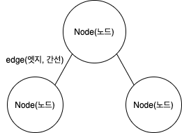
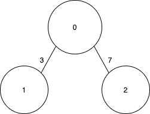

## 그래프(Graph)
### 기본구조

그래프는 `node(노드)`와 `edge(엣지)`로 표현되는 자료구조이다. node 와 edge를 각각 vertex, arc라고 부르기도 한다. 각 node는 값을 가질 수 있고, weighted graph라면 edge도 weight 값을 가질 수 있다. 또, edge가 방향성이 있어서 A => B 와 B => A 가 다른 경우, Directed graph라고 한다.

### 표현방식
그래프를 프로그래밍으로 표현할 수 있는 방법은 `인접 행렬(Adjacency Matrix)`, `인접 리스트(Adjacency List)` 두 가지가 있다.

위의 그래프는 간단한 weighted graph 이다. 이 그래프를 두 방식으로 표현해 볼 수 있다. 
#### 인접 행렬(Adjacency Matrix)
인접 행렬 방식은 2차원 배열에 각 노드가 연결된 형태를 기록하는 방식이다. 파이썬의 경우, 리스트 자료형을 사용하여 나타낼 수 있다. 
```python
INF = 999999999

# 2차원 리스트로 인접 행렬 표현
graph = [
    [0,3,7],
    [3,0,INF],
    [7,INF,0]
]
```
`graph[0]`이 0번 node와 다른 node들 간 연결상태를 나타내는 리스트 `[0,3,7]`을 가진다. 자기 자신과의 연결상태는 `0`으로 나타내고, edge로 연결되지 않을 경우, `INF`로 무한대로 나타낸다. 
#### 인접 리스트(Adjacency List)
인접 리스트 방식은 `Linked List(연결 리스트)`라는 자료구조를 사용해서 그래프의 연결상태를 나타낸다. 파이썬의 경우, 기본 자료형인 리스트 자료형을 사용해서 linked list의 기능을 표현할 수 있으므로 이 경우에도 2차원 리스트를 사용해서 표현한다. 
```python
# 노드가 3개인 그래프 => 행이 3개인 2차원 리스트로 표현
graph = [[] for _ in range(3)]

# node 0
graph[0].append((1,3)) #연결정보를 (노드번호, weight)의 tuple로 표현
graph[0].append((2,7))

# node 1
graph[1].append((0,3))

# node 2
graph[2].append((0,7))
```
위처럼 2차원 리스트로 `linked list`를 표현하고, 각 node 번호에 해당하는 list에 `(연결된 노드 번호, weight(거리))`형태의 tuple로 연결 정보를 저장한다.

#### 두 표현방식 장단점
두 표현방식은 시간복잡도, 공간복잡도의 측면에서 차이가 있다. 
노드의 개수를 `N`, 엣지의 개수를 `E`라고 할 때,
>
- `인접 행렬`의 경우, 
특정 두 node 간의 edge 존재여부를 `O(1)`의 시간안에 찾을 수 있다. 2차원 matrix에 바로 접근하면 되기 때문이다. node의 차수는 `O(N)`안에 알 수 있다. 전체 edge를 탐색할 경우 `O(N^2)`의 시간이 소요된다. 
하지만 메모리의 측면에서 `O(N^2)`만큼의 메모리가 필요해서 node간에 edge가 존재하지 않는 메모리 공간이 낭비된다.
- `인접 리스트`의 경우,
특정 두 node 간의 연결 정보를 알기 위해서 소요되는 시간은 해당 node에 연결된 edge의 개수에 따라 달라진다. 전체 edge를 탐색하는 경우 `O(N+E)`의 시간이 소요된다. 
메모리의 경우, 각 node와 각 node에 연결된 edge를 표현해야 하므로 `O(N+E)`의 공간복잡도가 소요된다. 

따라서 `인접 행렬`의 경우, 그래프에 edge가 많이 존재하는 `Dense graph`에서 유리하고, `인접 리스트`의 경우 edge가 많이 없는 `Sparse graph`에서 유리한 표현방식이다.

### 📚 Reference
> 
* https://m.blog.naver.com/PostView.nhn?blogId=kbs4674&logNo=220727852469&proxyReferer=https:%2F%2Fwww.google.com%2F
* https://gmlwjd9405.github.io/2018/08/13/data-structure-graph.html
* 『이것이 취업을 위한 코딩테스트다 with 파이썬』
https://github.com/ndb796/python-for-coding-test