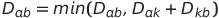

## 최단경로 알고리즘(Shortest path algorithm)
최단경로 알고리즘은 그래프에서 정점간에 가장 짧은 경로를 찾는 알고리즘을 뜻한다. 

최단 경로 알고리즘에도 몇가지 종류가 있는데, 한 특정 지점에서 다른 모든 지점까지의 최단경로를 구하는 경우 `Single-source shortest path algorithm` 이라고 하며, 모든 지점에 대해 그 점을 제외한 다른 지점들 까지의 모든 최단경로를 구하는 경우 `All-pairs shortest path algorithm`이라고 한다. 

이 포스트에서는 
`single-source shortest path algorithm`에 해당하는 **다익스트라 알고리즘**과 
`all-pairs shortest path algorithm`에 해당하는 **플로이드-워셜 알고리즘**을 살펴보고자 한다.

***
### 다익스트라 알고리즘(Dijkstra's algorithm)

`다익스트라 알고리즘`은 `single-source shortest path algorithm`으로, 엣지에 방향이 있고, weight이 존재하는 `weighted directed graph`에 대해서 특정 노드에서 출발해 다른 노드로 가는 각각의 최단 경로를 구하는 알고리즘이다.

하지만, 조건이 하나 있는데 **엣지의 weight이 음수이면 안된다.**

다익스트라 알고리즘의 기본적인 과정은 다음과 같다.
```markdown
1. 출발 노드 설정
2. 최단 거리 테이블 초기화(무한대로 초기화 하고, 자기자신에 대해서는 0으로 초기화)
3. 방문하지 않은 노드 중에 가장 최단 거리가 짧은 노드 선택
4. 선택한 노드를 거쳐 다른 노드로 가는 비용을 계산하여 기존의 최단거리 테이블과 비교하여 갱신한다.
5. 3, 4 번을 반복한다.
```
다익스트라 알고리즘은 `각 노드에 대한 현재까지의 최단거리 정보`를 최단거리 테이블에 저장하며 각 노드에 대해 과정을 반복하면서 테이블을 갱신한다. 이 때, 매번 현재 처리하는 노드를 기준으로 최단경로를 확인하여 update한다는 점에서 `그리디 알고리즘`의 한 유형으로 볼 수 있다. 

다익스트라 알고리즘은 위의 과정 `3.`을 어떻게 처리하느냐에 따라 두가지 방식으로 구현할 수 있다. 
`방식 1.`은 가장 최단거리 테이블을 순차적으로 탐색하는 방법이고, 
`방식 2.`는 `우선순위 큐`를 활용하여 가장 최단거리가 짧은 노드를 선택하는 방법이다. 

#### 방식 1.
```python
import sys

input = sys.stdin.readline
INF = int(1e9)

# node 개수, edge 개수 입력받기
n, m = map(int, input().split())
# 시작 노드 번호 입력받기
s = int(input().rstrip())
# 각 노드에 연결되어있는 노드 정보 담는 리스트 만들기(adjacency list 방식)
graph = [[] for i in range(n + 1)]
# 방문여부 체크 리스트 만들기
visited = [False] * (n + 1)
# 최단거리 테이블 무한으로 초기화
distance = [INF] * (n + 1)

# 모든 간선 정보 입력받기
for _ in range(m):
    a, b, c = map(int, input().split())
    # a => b, weight = c
    graph[a].append((b, c))  # (도착 노드, weight) 형태로 저장

# 방문하지 않은 노드 중에서 최단거리가 가장 짧은 노드 번호 반환(순차 탐색 통해서)
def get_smallest_node():
    min_value = INF
    index = 0  # 가장 최단거리가 짧은 노드 index
    # 최단거리 테이블 순차탐색
    for i in range(1, n + 1):
        if distance[i] < min_value and not visited[i]:
            min_value = distance[i]
            index = i
    return index


def dijkstra(start):
    # 시작노드 초기화
    distance[start] = 0
    visited[start] = True
    # 최단거리 테이블 시작노드 연결정보로 update
    for j in graph[start]:
        distance[j[0]] = j[1]

    # 시작노드 제외, 전체 n-1개의 노드에 대해 반복
    for i in range(n - 1):
        # 현재 최단거리가 가장 짧은 노드 꺼내서 방문처리
        now = get_smallest_node()
        visited[now] = True
        # 현재노드(now)와 연결된 노드 확인
        for j in graph[now]:
            # 현재 노드 거쳐서 연결된 노드로 가는 비용
            cost = distance[now] + j[1]
            if cost < distance[j[0]]:
                distance[j[0]] = cost


# 다익스트라 알고리즘 수행
dijkstra(s)


# 모든 노드로 가기위한 최단거리를 출력
for i in range(1, n + 1):
    if distance[i] == INF:
        print("INF")
    else:
        print(distance[i])
```
`방식 1.`의 경우 최단거리 테이블을 매번 선형탐색하는 것을 반복해야하고, 이것을 총 `O(V)` 번 반복하기 때문에 시간복잡도는 `O(V^2)`이다. 

따라서 전체 노드개수가 5000개 이하로 적을 경우 사용이 가능하지만, 두번째 방식을 알아두고 사용하는 것이 바람직하다.
#### 방식 2.(우선순위 큐 사용)
```python
import heapq
import sys

input = sys.stdin.readline
INF = int(1e9)

# 노드개수, 간선개수 입력받기
v, e = map(int, input().rstrip().split())
# 시작노드번호 입력받기
s = int(input().rstrip())
# 그래프 연결정보 adjacency list
graph = [[] for i in range(v + 1)]
# 최단거리 테이블 초기화
distance = [INF] * (v + 1)

# 간선정보 입력받기
for _ in range(e):
    # a => b, weight = c
    a, b, c = map(int, input().rstrip().split())
    graph[a].append((b, c))


def dijkstra(start):
    q = []
    # 시작 노드로 가기 위한 최단경로는 0으로 설정, 큐에 삽입
    heapq.heappush(q, (0, start))
    distance[start] = 0
    while q:  # 큐가 비어있지 않다면,
        # 가장 최단거리가 짧은 노드 정보 꺼내기
        dist, now = heapq.heappop(q)
        # 현재 노드가 이미 처리된 적이 있는 노드이면 무시 -- 이미 처리된 최단거리값이 더 작으면 무시
        if distance[now] < dist:
            continue
        # 현재 노드와 연결된 인접노드들 확인
        for i in graph[now]:
            cost = dist + i[1]
            # 현재노드(now)거쳐서 가는 거리가 더 짧은 경우
            if cost < distance[i[0]]:
                distance[i[0]] = cost
                heapq.heappush(q, (cost, i[0]))


# 다익스트라 알고리즘 수행
dijkstra(s)

# 모든 노드로의 최단거리 출력
for i in range(1, v + 1):
    if distance[i] == INF:
        print("INF")
    else:
        print(distance[i])
```
`방식 2.`는 최단거리가 가장 짧은 노드를 선정하는 과정에서 `힙(heap)`자료구조를 활용하여 만든 `우선순위 큐`를 사용한다. 

따라서 순차탐색을 통한 `방식 1.` 보다 속도가 빠르다.

시간복잡도는 `O(ElogV)`이다. _(V는 노드 개수, E는 엣지 개수)_
우선순위큐에 E개의 원소를 넣었다 빼는 연산과 유사하여 간단하게 O(ElogE)로 나타낼 수 있는데, _logE_는 항상 _logV^2_보다 작고, 빅오로 나타내면 
`O(logE)` 보다 `O(logV^2) == O(logV)`는 항상 크므로 `O(ElogV)`로 이해할 수 있다.

📌 파이썬에서는 `heapq`라이브러리를 활용하여 쉽게 우선순위 큐를 구현할 수 있다. 
***
### 플로이드-워셜 알고리즘(Floyd-Warshall algorithm)

`플로이드-워셜 알고리즘`은 `All-pairs shortest path algorithm`으로, 모든 노드 쌍에 대해서 최단 경로를 구하는 경우에 사용하는 알고리즘이다. 

`플로이드-워셜 알고리즘`도 `다익스트라 알고리즘`과 같이 거쳐가는 노드를 중심으로 노드의 개수 V만큼 반복하고, 매번 `현재 노드를 거쳐가는 모든 경로`를 고려하여 `O(V^2)`의 연산을 하게 된다. 따라서, 시간복잡도는 `O(V^3)`으로 나타낼 수 있다.

또, `플로이드-워셜 알고리즘`은 최단거리 테이블로 `인접행렬(adjacency matrix)` 형태의 2차원 리스트가 사용된다. 이 때 _V * V_의 인접행렬 형태로 그래프를 표현하여 최단거리 테이블로 사용하기 때문에 단계별로 `O(V^2)`의 시간이 걸리는 것이다.

그리고 이 알고리즘은 최단거리 테이블을 **점화식 형태**로 표현된 연산을 통해 갱신하기 때문에 `다이나믹 프로그래밍(dynamic programming)`의 한 유형이다.

노드 a, b 사이의 최단 경로는 거쳐가는 노드 k에 대하여 다음과 같이 표현할 수 있다.

이 식에 따라 모든 노드에 대해 반복하면서 최단거리 테이블을 업데이트하면, 최종 테이블 `graph`의 `graph[a][b]`가 a와 b사이의 최단거리가 된다.

```python
INF = int(1e9)

# 노드 개수 및 간선 개수 입력받기
v = int(input())
e = int(input())
# 2차원 리스트 만들고 (adjacency matrix)모든 값 무한으로 초기화
graph = [[INF] * (v + 1) for _ in range(v + 1)]

# 자기 자신에서 자기 자신으로 가는 비용은 0으로 초기화
for a in range(1, v + 1):
    for b in range(1, v + 1):
        if a == b:
            graph[a][b] = 0

# 각 간선 정보 입력받아서 graph 초기화
for _ in range(e):
    a, b, c = map(int, input().split())
    # a=>b, weight: c
    graph[a][b] = c

# 점화식에 따라 플로이드 워셜 알고리즘 수행
for k in range(1, v + 1):
    for a in range(1, v + 1):
        for b in range(1, v + 1):
            graph[a][b] = min(graph[a][b], graph[a][k] + graph[k][b])

# 수행결과 출력
for a in range(1, v + 1):
    for b in range(1, v + 1):
        if graph[a][b] == INF:
            print("INF", end=" ")
        else:
            print(graph[a][b], end=" ")
    print()  # 개행


```
위와 같이 2차원 리스트 형태의 최단거리 테이블을 초기화 한 후, 현재 거쳐가는 노드 k에 대해 노드들의 쌍(a,b)의 최단거리를 점화식을 통해 update하는 삼중 반복문을 사용하면 `O(V^3)`의 시간내에 모든 노드 쌍에 대해 최단거리를 계산할 수 있다. 
***
## 📚 Reference
이 글은 _『이것이 코딩테스트다 with 파이썬』_ 을 통해 공부하면서 작성한 글입니다.
>
* 『이것이 코딩테스트다 with 파이썬』, 나동빈 지음
* 고려대학교 정순영 교수님 알고리즘 강의자료